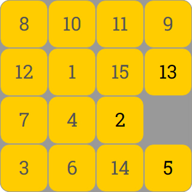
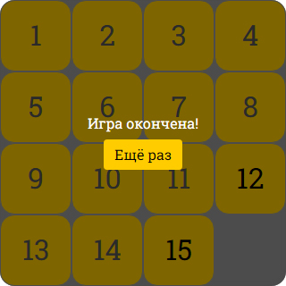

# Игра "Пятнашки"
Реализация популярной головоломки "Пятнашки" на JavaScript. 

Цель игры заключается в том, чтобы расположить костяшки по возрастанию номеров, передвигая их по полю.




[Играть в "Пятнашки"](https://mchlv.ru/projects/15ki/)


Когда все костяшки расположены в нужном порядке, появляется сообщение об завершении игры:




## Параметры игры
Хранятся в переменныx в файле ```app.js```. Задают html-контейнеры игрового поля, количество костяшек в ряду и их размеры:

```javascript
const tags = document.querySelector('.tags');       // блок контейнера 
const tagsField = tags.querySelector('.tags__field'); // блок игрового поля с костяшками
const tagWidth = 80;                                // ширина костяшки, px
const size = 4;                                     // количество костяшек в ряду
let emptyCoords = {};                               // координата пустого места
let numbers = getRandNumbers();
```

Блоки на странице:
```html
<div class="tags">
    <div class="tags__field"></div>
</div>
```

## Как работает
В начале игры создается массив с заданным в параметрах размером ```size = 4```. Каждый элемент массива также является массивом с тем же размером ```size = 4```. 

Массивы случайным образом заполняются числами от 0 до 15. 0 - соответствует пустому месту на игровом поле, 1 - костяшке с №1, 2 - костяшке с №2 и т.д.

Передвигая костяшки по полю, числа переставляются в массивах и проводится проверка на победу. 

Пример массива:
```javascript
let arr = [
    [6, 2, 0, 4],
    [5, 13, 7, 8],
    [10, 9, 14, 15],
    [1, 11, 12, 3]
];
```

